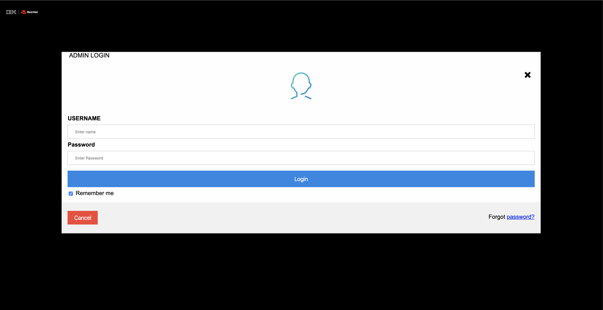
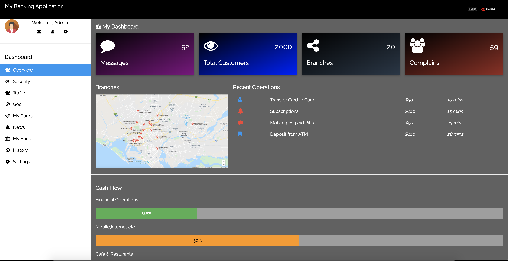

## This is a microserivce for admin

1. Open your terminal and run command `git clone https://github.com/mahsankhaan/micro-admin.git`.   
2. Now if you want to run this project locally, kindly **uncomment** the bottom section from app.js file (open the file and check more details how to uncomment the section )
3. Now from your terminal change your directory to the folder where you downloaded this project.
4. Once you're in the project directory ,now run command `node app.js`.
5. And now you can see the Login page. 

### NOTE: In login screen, password is "123" and username is "admin"

6. Once successfully login, you can see the admin dashboard.

